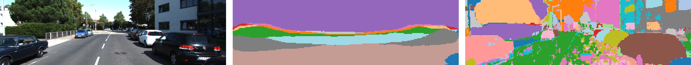
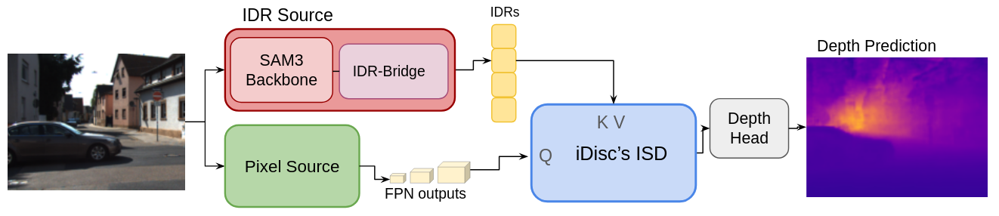
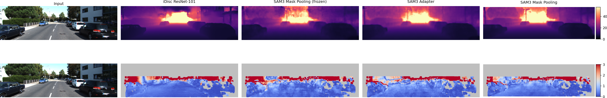

# SAM3 + iDisc Depth Estimation

The project fork replaces iDisc's ResNet/Swin pixel encoder with a frozen SAM3 backbone
(~840M params) and trains a small iDisc head (~12M params) on top, on KITTI. The question:
is the depth signal in iDisc's internal discretization (the IDR bottleneck), so that a
grounded, object-aware partition from SAM3 would improve depth?

The result is negative: **depth accuracy is invariant to the partition's source.** Sourcing the
IDRs from SAM3 — queries via a linear projection or an attention adapter, or mask-pooled
object centers — leaves accuracy unchanged, and the partition's object-grounding does not
help. The partition is still *used* (ablating it multiplies error several-fold), but the head
treats it as a generic scene-specific container; depth supervision then erases the masks'
object structure (region/depth R² 0.75 → 0.26 under fine-tuning), which is why object-token
tracking cannot deliver temporal stability in this model.

Built on [iDisc](https://github.com/SysCV/idisc) (Piccinelli et al., CVPR 2023).


*iDisc's AFP partition (fragmented, ungrounded) vs SAM3's object masks (clean, grounded).*


*A frozen SAM3 backbone feeds iDisc's depth head; the pixel source and IDR source are swappable.*

## Results (KITTI Eigen test — AbsRel / δ1 / RMSE)

SAM3 rows use the fused-memory pixel source with the SAM3 post-trunk unfrozen.

| IDR source | steps | AbsRel ↓ | δ1 ↑ | RMSE ↓ |
|---|---|---|---|---|
| ResNet-101 (baseline) | 45k | **0.0600** | 0.9638 | 2.362 |
| SAM3 linear (queries) | 5k / 15k | 0.0691 / 0.0618 | 0.9546 / 0.9643 | 2.470 / 2.347 |
| SAM3 adapter (attention) | 5k / 15k | 0.0685 / 0.0607 | 0.9548 / 0.9652 | 2.459 / 2.310 |
| SAM3 mask-linear (masks) | 5k / 15k | 0.0689 / 0.0619 | 0.9549 / 0.9638 | 2.494 / 2.326 |

At a matched budget the three SAM3 sources agree to within ~0.001 AbsRel; with more training
they all reach the baseline (the adapter passing it on δ1 and RMSE at 15k). The longer budget,
not the choice of source, closes the gap. Full number → run provenance and re-run commands:
[docs/SAM2Depth/REPRODUCIBILITY.md](docs/SAM2Depth/REPRODUCIBILITY.md).


*Predicted depth (top) and error vs LiDAR (bottom): the baseline and the SAM3 variants are visually near-identical.*

## Docs

| Doc | What's in it |
|-----|--------------|
| [docs/SAM2Depth/ARCHITECTURE.md](docs/SAM2Depth/ARCHITECTURE.md) | how the model is wired together, the key files, the data flow, the Hydra config setup, and how to add an experiment |
| [docs/SAM2Depth/REPRODUCIBILITY.md](docs/SAM2Depth/REPRODUCIBILITY.md) | every reported number → the run/method and config that produced it, with re-run commands |
| [docs/INSTALL.md](docs/INSTALL.md) · [docs/DATA.md](docs/DATA.md) | environment setup and dataset preparation |

Older experiment notes are archived under [docs/SAM2Depth/legacy/](docs/SAM2Depth/legacy/).

## Dependencies

Python 3.12. The exact environment used for every reported result is pinned in
[`requirements-lock.txt`](requirements-lock.txt); the main external libraries are:

| Library | Version | Link |
|---|---|---|
| PyTorch | 2.12.0 (cu128) | https://pytorch.org |
| torchvision | 0.26.0 (cu128) | https://pytorch.org/vision |
| SAM3 (Meta AI) | 0.1.0, from source | https://github.com/facebookresearch/sam3 |
| Hydra | 1.3.2 | https://hydra.cc |
| OmegaConf | 2.3.0 | https://github.com/omry/omegaconf |
| timm | 1.0.25 | https://github.com/huggingface/pytorch-image-models |
| einops | 0.8.2 | https://github.com/arogozhnikov/einops |
| OpenCV (opencv-python) | 4.11.0.86 | https://opencv.org |
| NumPy | 1.26.4 | https://numpy.org |
| SciPy | 1.17.1 | https://scipy.org |
| Weights & Biases (optional) | 0.26.1 | https://wandb.ai |

Install the base requirements with `pip install -r requirements.txt` (or
`requirements-lock.txt` for the exact pinned versions), build the deformable-attention op
(`idisc/models/ops/make.sh`), and install SAM3 from source. See [docs/INSTALL.md](docs/INSTALL.md).

## Checkpoints

Checkpoints used in this work, with their sources:

- **Trained in this work** — fine-tuned SAM3 heads (15k iterations), each a head module that
  loads on top of the frozen SAM3 backbone (so SAM3, below, is required to run it). Each
  download contains the checkpoint (`best_sam_finetuned.pt`) and its `resolved_config.yaml`:

  | Model | AbsRel | Download |
  |---|---|---|
  | SAM3 linear (queries) | 0.0618 | [checkpoint + config](https://drive.google.com/file/d/1SgXYDuAEe7FS9DGBH9z-GqAD1T8Qsxw1/view?usp=sharing) |
  | SAM3 adapter (attention) | 0.0607 | [checkpoint + config](https://drive.google.com/file/d/1TKY_RH_FC-MWB45cRT2QmK1PkPV9BjOS/view?usp=sharing) |
  | SAM3 mask-linear (masks) | 0.0619 | [checkpoint + config](https://drive.google.com/file/d/1Gv2-80aG6HB3mij_5J8oSGWO8Paow3uy/view?usp=sharing) |
- **iDisc baseline** (`kitti_resnet101.pt`, `nyu_resnet101.pt`) — from the
  [iDisc model zoo](https://github.com/SysCV/idisc).
- **SAM3 backbone** (`sam3.pt`, ~3.4 GB) **and** the `sam3` source — from
  [Meta SAM3](https://github.com/facebookresearch/sam3) (see [INSTALL §4](docs/INSTALL.md)).

### Running the checkpoints

1. Set up the environment, build the deformable-attention op, and install SAM3 —
   [INSTALL §1–4](docs/INSTALL.md).
2. Download a checkpoint (the download includes its `resolved_config.yaml`) and the SAM3
   backbone `sam3.pt` (Meta).
3. Prepare KITTI Eigen — [DATA.md](docs/DATA.md).
4. In that `resolved_config.yaml`, set `paths.sam_checkpoint` → your `sam3.pt` and
   `paths.kitti_root` → your KITTI root.
5. Evaluate:
   ```bash
   python scripts/experiments/eval_depth.py \
     --config <resolved_config.yaml> \
     --checkpoint <ours>.pt \
     --output-dir output/runs/eval-demo
   ```
   AbsRel / δ1 / RMSE are printed and written to `output/runs/eval-demo/metrics.json`.

**Single-image demo.**

```bash
python scripts/demo.py \
  --config <resolved_config.yaml> \
  --checkpoint <ours>.pt \
  --image <rgb.png> --out depth.png
```

It writes a colormapped depth map for one RGB image.

The config matching each checkpoint is listed in
[docs/SAM2Depth/REPRODUCIBILITY.md](docs/SAM2Depth/REPRODUCIBILITY.md).

## Quickstart

Everything runs on the cluster. `scripts/launch.sh` wraps
`run_with_hydra.py` in an sbatch job with the CUDA module, venv, and a GPU already
configured, so that setup does not need to be repeated for every run.

```bash
# train / eval — the full list of experiment keys is in ARCHITECTURE.md
./scripts/launch.sh experiment=finetune_sam3_kitti_linear_mem
./scripts/launch.sh experiment=eval_idisc_kitti_image
./scripts/launch.sh experiment=finetune_sam3_kitti_video finetune.n_iters=500   # quick shakedown

# regenerate the visualization GIFs (one GPU, ~5 min)
sbatch scripts/vis/visualize_all.sh        # writes to output/runs/viz/*
```

Every run writes its artifacts to `output/runs/<timestamp>_<exp_id>_<sha>/` (the
`resolved_config.yaml`, `metrics.json`, and logs), and the checkpoints go to
`output/models/<exp_id>/`. The visualization and evaluation scripts read a run's
`resolved_config.yaml` rather than the `conf/` tree directly.

## Repo layout (fork-specific)

```
conf/                     Hydra config tree (config.yaml + experiment/ model/ finetune/ paths/ tracking/)
idisc/models/             sam3_encoder.py, sam3_video_encoder.py, id_module.py, idisc.py
idisc/dataloders/         kitti_sequence.py (clip sampling), kitti.py, ...
scripts/launch.sh         SLURM launcher (train/eval)
scripts/train.py          training loop (run_train)
scripts/experiments/      eval_depth.py (run_eval)
scripts/utils/            visualize_sequence.py, visualize_sam3.py, visualize_sam3_masklets.py, visualize_all.sh
output/runs/, output/models/   per-run artifacts and checkpoints
docs/SAM2Depth/           this documentation (legacy/ holds archived experiment notes)
```

---

*Parts of this code and documentation were developed with the assistance of Claude (Anthropic).*
