# IDR Visualization Results

Qualitative analysis of IDRs across the iDisc baseline,
the SAM3 image encoder, and the SAM3 video encoder on KITTI videos.

All models below are the May-2026 finetuning runs in ` /work/courses/3dv/team17/results/models`, all trained in
`replace` mode (SAM3 decoder queries projected straight into IDRs via `sam3_proj`)

## Models compared

| Run (`/work/courses/3dv/team17/results/models`) | Encoder | IDR source | best abs_rel |
|---|---|---|---:|
| `finetune-idisc-image` | ResNet-101 | AFP | **0.060** |
| `finetune-idisc-video` | ResNet-101 | AFP | **0.059** |
| `finetune-sam3-image`  | SAM3 image (frozen) | SAM3 → `replace` | 0.084 |
| `finetune-sam3-video`  | SAM3 video (frozen) | SAM3 → `replace` | 0.103 |

---

## Key findings

1. SAM3 IDRs do not beat the AFP baseline. SAM3-image reaches 0.084 and
   SAM3-video 0.103 abs_rel (behind 0.060 of the plain iDisc
   baselines)

2. ISD attention over the IDR tokens is diffuse. Entropy is ~3.37/3.47 for the 32 AFP
   latents and ~4.84/5.30 for the 200 SAM3 queries (91–97% of the uniform max). Pixels
   barely select individual tokens, so depth comes from the FPN, not the IDR path.

3. SAM3-video depth is poorly calibrated outside supervised regions. The depth scale blows
   up over sky (no GT under the Garg crop), while baseline and SAM3-image stay in a
   sensible 0–80 m range.

---

## Visual comparisons

Clips (drive 0046, clip 050, 4 frames at 1 fps)

### Baseline iDisc (AFP, no SAM3)

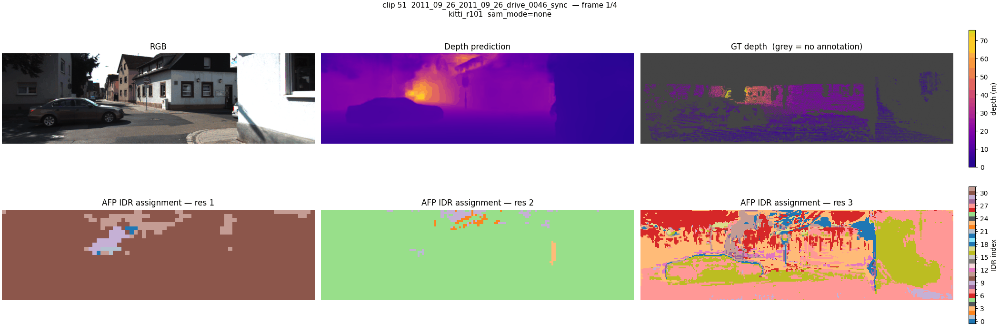

ResNet-101 AFP features with hard IDR assignment (32 latents). This is the reference depth (abs_rel ~0.060).

### SAM3 image encoder (replace mode)

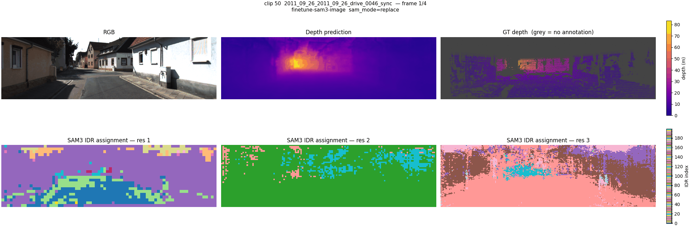

Frozen SAM3 image encoder; the 200 decoder queries go into IDRs via `sam3_proj`. IDR maps
are more fragmented (200 slots vs 32), but depth is worse than baseline (abs_rel 0.084).

### SAM3 video encoder (replace mode)

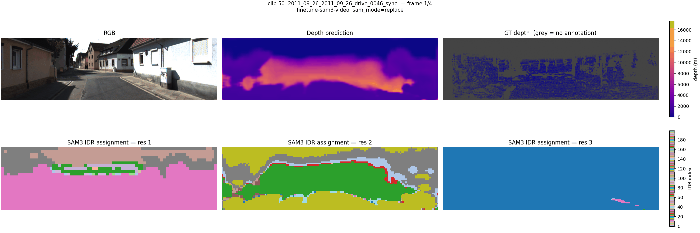

Whole clip through the SAM3 video backbone once, per-frame FPN and queries to iDisc. IDR
structure differs from image mode, depth scale less calibrated (abs_rel 0.103).

---

## Detailed clip comparisons

### IDR maps, image encoders (`viz_seq`)

Per-frame inference. Layout per frame: `[RGB | Depth pred | GT depth]` /
`[ISD IDR res1 | res2 | res3]`.

| Model | Clip 050 | Clip 051 | Clip 052 |
|------|----------|----------|----------|
| baseline iDisc (AFP) | 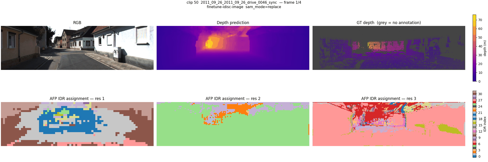 | 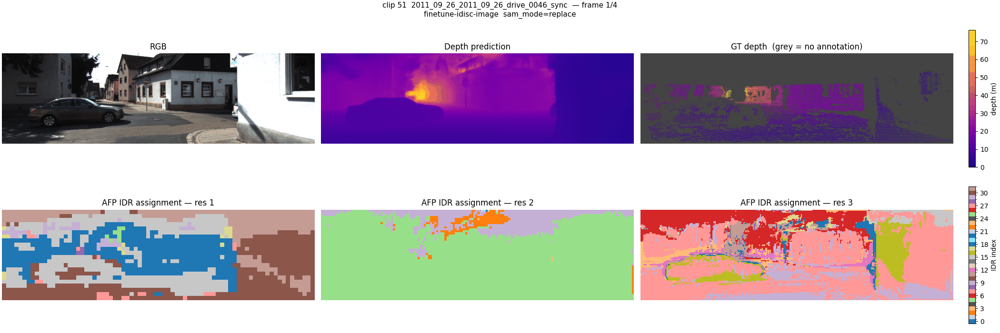 | 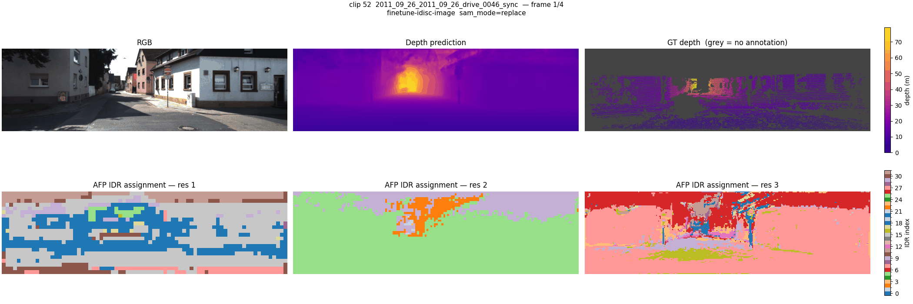 |
| SAM3 image (`replace`) |  | 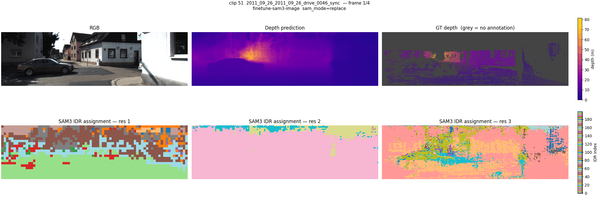 | 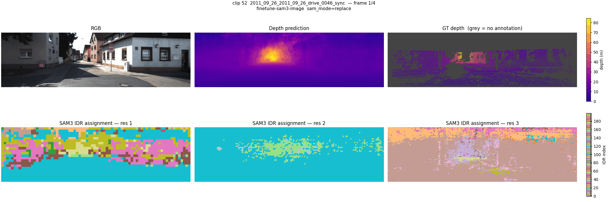 |

### IDR maps, video encoders (`viz_seq_video`)

Same layout, but the clip goes through the (ResNet sequence / SAM3 video) backbone.

| Model | Clip 050 | Clip 051 | Clip 052 |
|------|----------|----------|----------|
| baseline iDisc (AFP) | 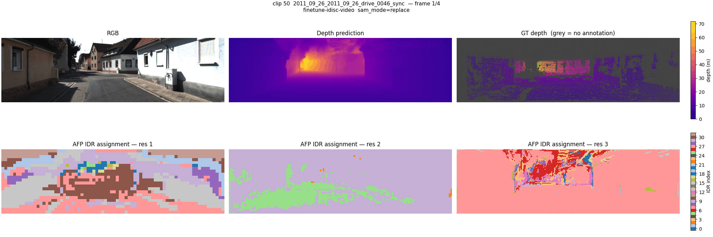 | 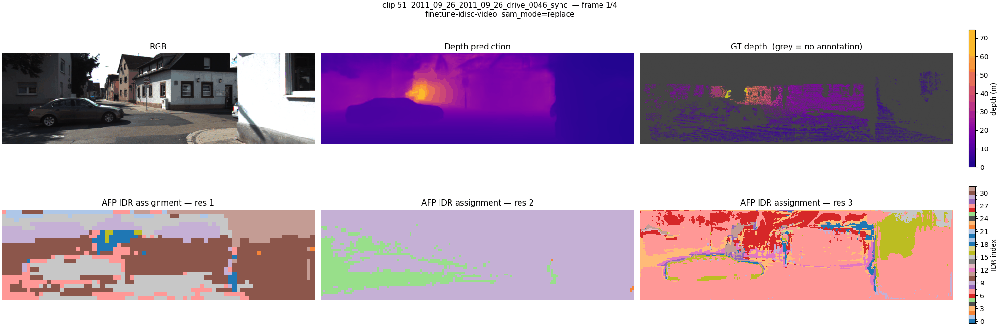 | 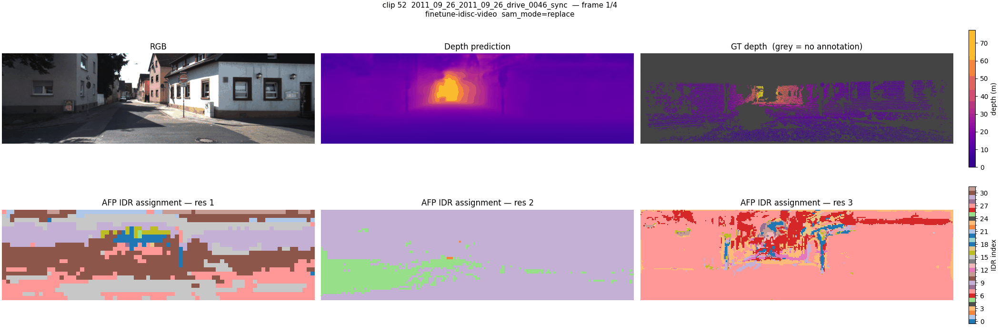 |
| SAM3 video (`replace`) |  | 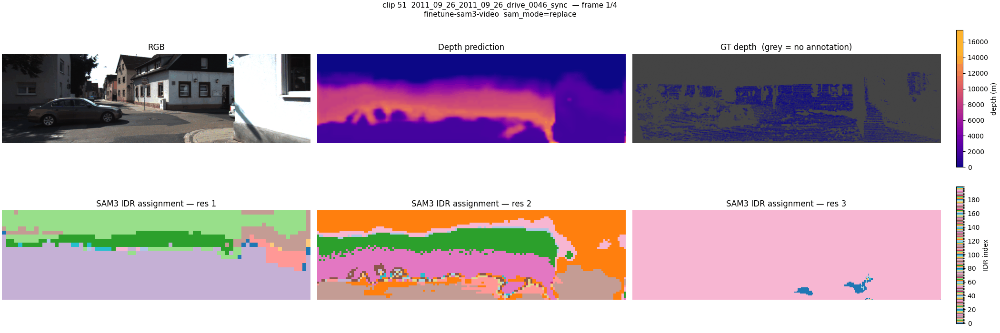 | 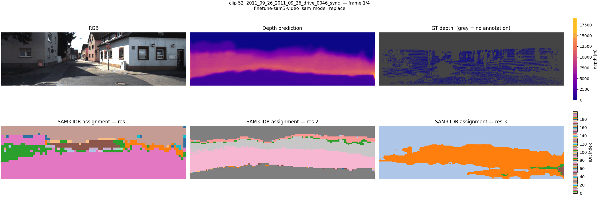 |

### SAM3 image-encoder masks (`viz_sam3`)

Per-frame SAM3 segmentation slot assignment and top-K mask overlays for
`finetune-sam3-image`. Layout: `[RGB | SAM3 slot assignment | top-K overlay]` /
`[slot 0 | slot 1 | ...]`.

| Clip 050 | Clip 051 | Clip 052 |
|----------|----------|----------|
| 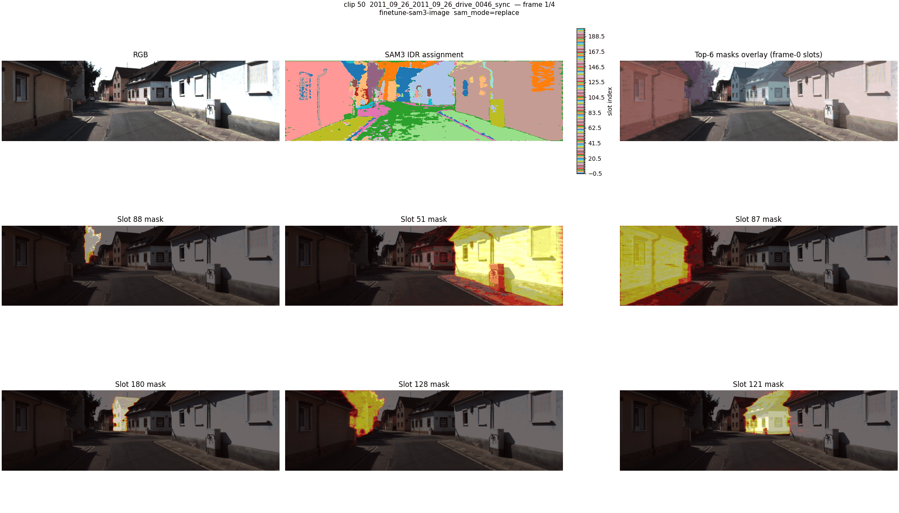 |  | 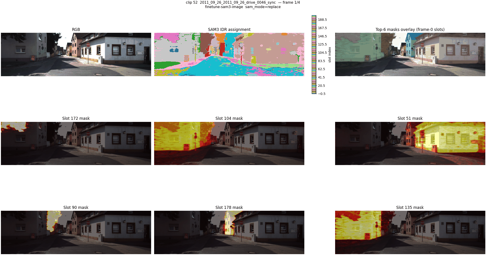 |

### Video masklets (`viz_masklets`)

SAM3 video tracker masklets for `finetune-sam3-video`, rendered at detection threshold 0.0.
Layout: `[RGB | Masklet ID assignment | top-K
overlay]` / `[ISD IDR res1 | res2 | res3]` / `[masklet 0..N]`.

| Clip 050 | Clip 051 | Clip 052 |
|----------|----------|----------|
| 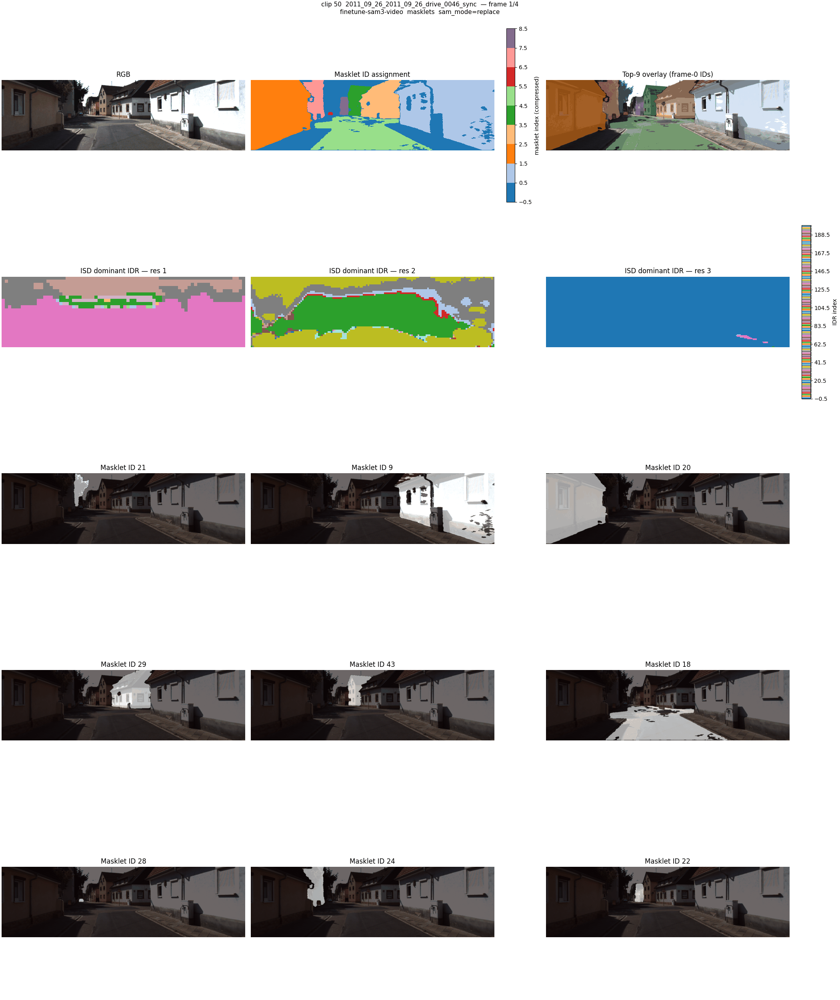 | 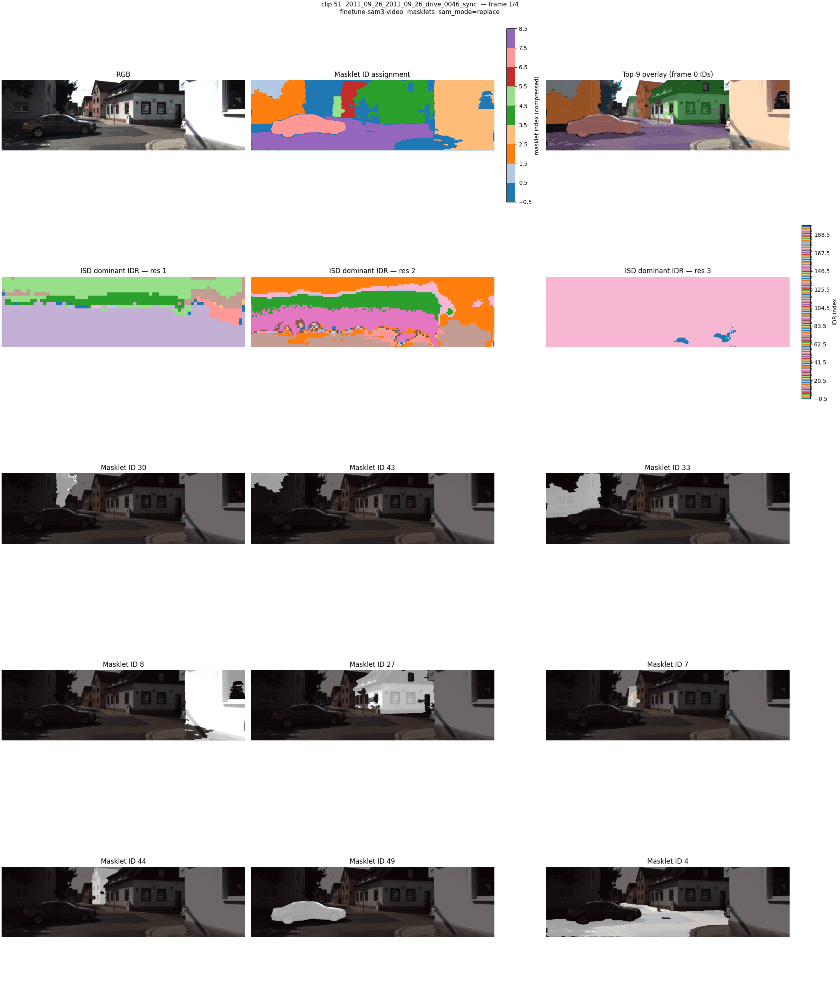 | 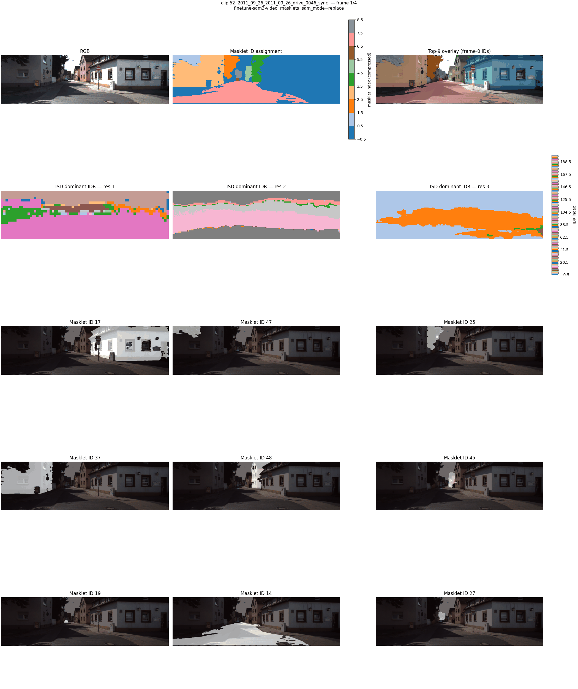 |

### Attention grids (`visualize_experiments.py`)

Per-IDR attention on a single frame (clip 050). For the AFP baseline each panel shows where
one of the 32 latents attends. SAM3 `replace` bypasses AFP, so there only the ISD
dominant-IDR map is available (the same view as `viz_seq`).

Baseline, AFP latent attention (res 1, 32 latents):

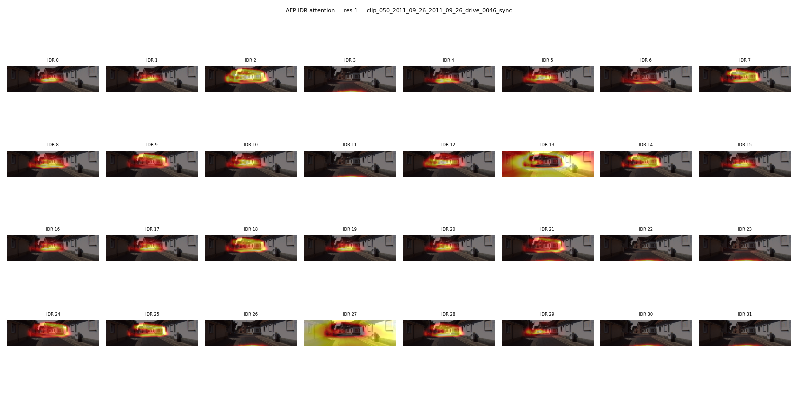

SAM3 image, ISD dominant-IDR per pixel (res 2):

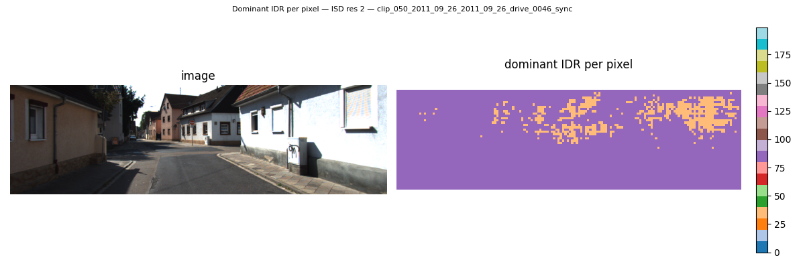

---

## Reproduction

```bash
sbatch scripts/utils/visualize_all.sh        # writes GIFs under output/runs/viz/*
```

### Checkpoints and configs

Each script takes a checkpoint (`best_sam_finetuned.pt`) and that run's resolved Hydra
config (`resolved_config.yaml`):

```
BASE_PATH        = /work/courses/3dv/team17/idisc
baseline image   = /work/courses/3dv/team17/results/models/finetune-idisc-image/best_sam_finetuned.pt
                   /work/courses/3dv/team17/results/runs/2026-05-28_18-22-11_finetune-idisc-image_7d21415/resolved_config.yaml
baseline video   = /work/courses/3dv/team17/results/models/finetune-idisc-video/best_sam_finetuned.pt
                   /work/courses/3dv/team17/results/runs/2026-05-28_16-03-16_finetune-idisc-video_7d21415/resolved_config.yaml
SAM3 image       = /work/courses/3dv/team17/results/models/finetune-sam3-image/best_sam_finetuned.pt
                   /work/courses/3dv/team17/results/runs/2026-05-28_08-37-35_finetune-sam3-image_c608a2d/resolved_config.yaml
SAM3 video       = /work/courses/3dv/team17/results/models/finetune-sam3-video/best_sam_finetuned.pt
                   /work/courses/3dv/team17/results/runs/2026-05-28_10-37-58_finetune-sam3-video_c608a2d/resolved_config.yaml
```

### Individual scripts

`--config-file` takes a resolved Hydra config, the `resolved_config.yaml` that
`scripts/run_with_hydra.py` writes into each `output/runs/<run>/`. Pick a run whose encoder
matches what you want to visualize. `--sam-mode` accepts `replace` or `translate` (the
AFP-only baseline ignores it and shows AFP IDRs).

```bash
# IDR maps over a clip (depth + ISD dominant-IDR per FPN resolution)
python scripts/utils/visualize_sequence.py \
  --config-file <run>/resolved_config.yaml --model-file <ckpt.pt> \
  --base-path /work/courses/3dv/team17/idisc \
  --output-dir output/runs/viz/seq --sam-mode replace \
  --start-clip 50 --num-clips 3 --clip-length 4 --fps 1

# SAM3 image-encoder slot assignments + top-K mask overlays (SAM3 image config)
python scripts/utils/visualize_sam3.py \
  --config-file <sam3-image-run>/resolved_config.yaml --model-file <ckpt.pt> \
  --base-path /work/courses/3dv/team17/idisc \
  --output-dir output/runs/viz/sam3_masks --sam-mode replace \
  --start-clip 50 --num-clips 3 --clip-length 4 --fps 1

# SAM3 video tracker masklets (SAM3 video config). --det-thresh 0.0 keeps all detections
python scripts/utils/visualize_sam3_masklets.py \
  --config-file <sam3-video-run>/resolved_config.yaml --model-file <ckpt.pt> \
  --base-path /work/courses/3dv/team17/idisc \
  --output-dir output/runs/viz/masklets --sam-mode replace \
  --start-clip 50 --num-clips 3 --clip-length 4 --fps 1 --num-masklets 9 --det-thresh 0.0

# Per-IDR attention grids on a single frame (AFP baseline / SAM3 image config)
python scripts/utils/visualize_experiments.py \
  --config-file <run>/resolved_config.yaml --model-file <ckpt.pt> \
  --base-path /work/courses/3dv/team17/idisc \
  --output-dir output/runs/viz/attn --sam-mode replace \
  --start-clip 50 --num-clips 1 --clip-length 4
```

### Common flags

| Flag | Default | Description |
|------|---------|-------------|
| `--sam-mode` | `replace` | `replace` uses the SAM3 linear projection, `translate` uses the Sam3QueryToIDR cross-attention |
| `--soft-assignment` | off | Weighted-average IDR index instead of hard argmax (`visualize_sequence.py` only) |
| `--clip-length` | from config | Frames per clip |
| `--start-clip` | 0 | Dataset clip index to start from |
| `--num-clips` | 3 | Number of clips to visualize |
| `--num-masklets` | 6 | Top-scoring masklets to show (`visualize_sam3_masklets.py` only) |
| `--det-thresh` | from config | Tracker detection threshold (`visualize_sam3_masklets.py`); 0.0 keeps all |
| `--format` | `gif` | Output format: `gif` or `mp4` (mp4 needs ffmpeg) |
| `--fps` | 2 | Animation frame rate |
