# IDR Visualization Results

Qualitative analysis of Implicit Depth Representations (IDRs) across iDisc baseline, SAM3 image encoder, and SAM3 video encoder modes on KITTI sequences (here visualized mostly on clips 50-51, drive 0046, but the trend is more general).

---

## Key Findings

1. **SAM3 video representations are clearly different from image-only ones.** The IDR maps produced by the video encoder have a visibly distinct structure compared to single-frame SAM3 or the AFP baseline, confirming that temporal conditioning changes the learned representations — not just refines them.

2. **iDisc baseline IDRs are flickery on sequential data.** When the AFP-only baseline is evaluated frame-by-frame over a clip, the dominant IDR assignment maps exhibit noticeable temporal inconsistency — IDR indices jump between frames even for static scene regions.

3. **SAM3 video masklets are correct.** The tracker-propagated masklet IDs remain stable across frames, with consistent object segmentation. The masklet visualization confirms that SAM3's video encoder produces temporally coherent object tokens.

4. **Depth estimation with SAM3 video mode performs poorly.** Despite correct masklets, the video encoder yields abs_rel ~0.22 vs ~0.08 for image-mode SAM3 (see experiments E14 vs E11/E12 in `SAM3_EXPERIMENTS.md`). The `sam3_proj` weights were not trained for temporally-propagated video queries, causing a large quality drop in actual depth prediction.

---

## Visual Comparisons

All GIFs are in `gifs/` and show 4-frame clips at 1 fps from KITTI drive 0046.

### Baseline iDisc (AFP only, no SAM3)


ResNet-101 AFP features with hard IDR assignment. Note the flickering IDR indices across frames — the representation is not temporally stable.

### SAM3 Image Encoder — Translate Mode

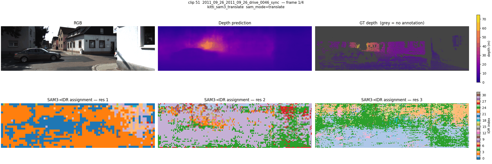

SAM3 queries injected via `Sam3QueryToIDR` cross-attention. IDR maps are more spatially coherent than the baseline but still change frame-to-frame since each frame is encoded independently.

### SAM3 Video Encoder — Translate Mode

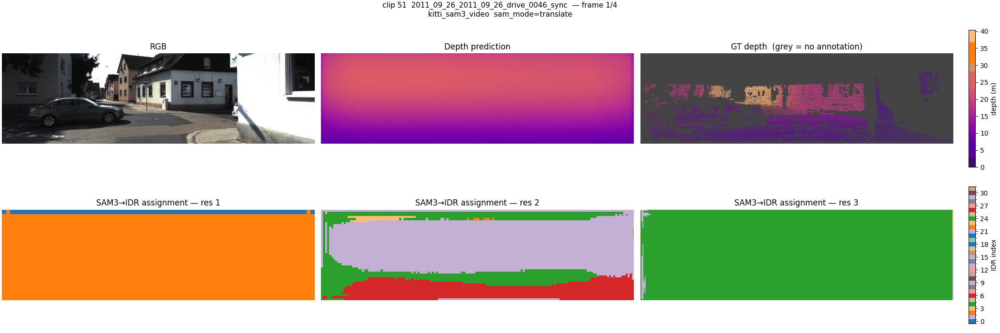

The full clip is processed through the SAM3 video encoder backbone, with per-frame FPN features dispatched to iDisc. IDR structure is visibly different from image mode. Depth quality is degraded (abs_rel ~0.22).

### SAM3 Video Masklets — Translate Mode


Masklet ID assignment from `Sam3VideoPixelEncoder`. IDs are locked from frame 0 and propagated via the tracker, producing temporally consistent segmentation across the clip.

---

## Detailed Clip Comparisons

### Sequence IDR Maps (`viz_seq`) — Image Encoder

Comparison of IDR maps across SAM modes using the image encoder (per-frame inference):

| Mode | Clip 050 | Clip 051 |
|------|----------|----------|
| `none` (AFP) | 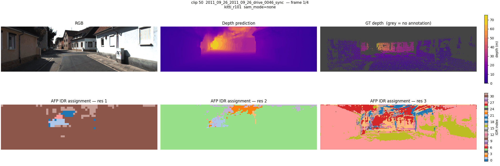 |  |
| `replace` | 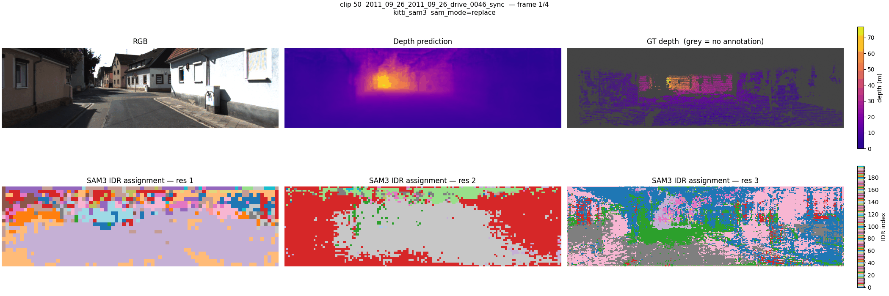 | 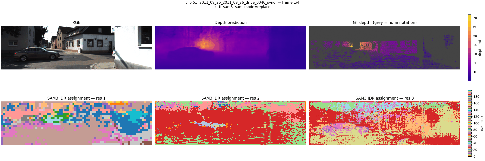 |
| `translate` | 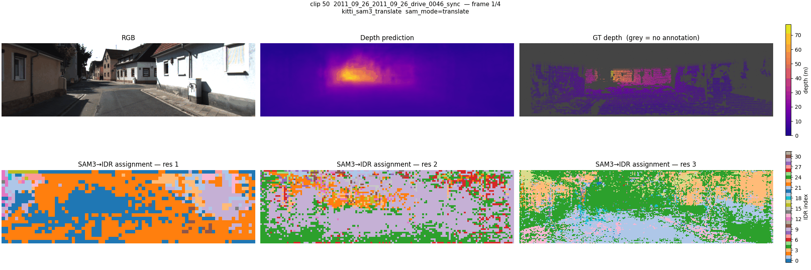 |  |

**Layout per frame:** `[RGB | Depth pred | GT depth] / [ISD res1 | ISD res2 | ISD res3]`

### Sequence IDR Maps (`viz_seq_video`) — Video Encoder

Same layout but the clip goes through the video encoder backbone once:

| Mode | Clip 050 | Clip 051 |
|------|----------|----------|
| `replace` | 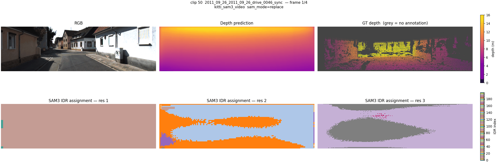 | 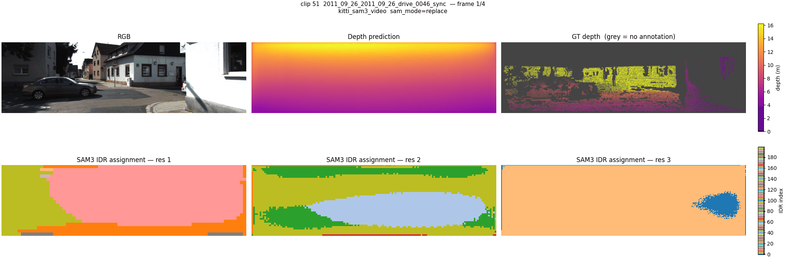 |
| `translate` | 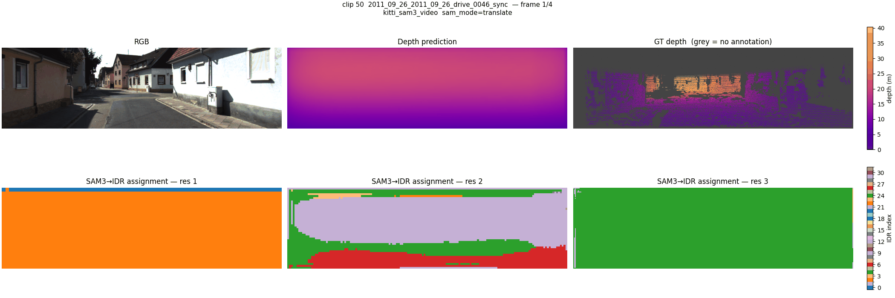 |  |

### SAM3 Image Encoder Masks (`viz_sam3`)

Per-frame SAM3 segmentation slot assignment and top-K mask overlays:

| Clip 050 | Clip 051 |
|----------|----------|
| 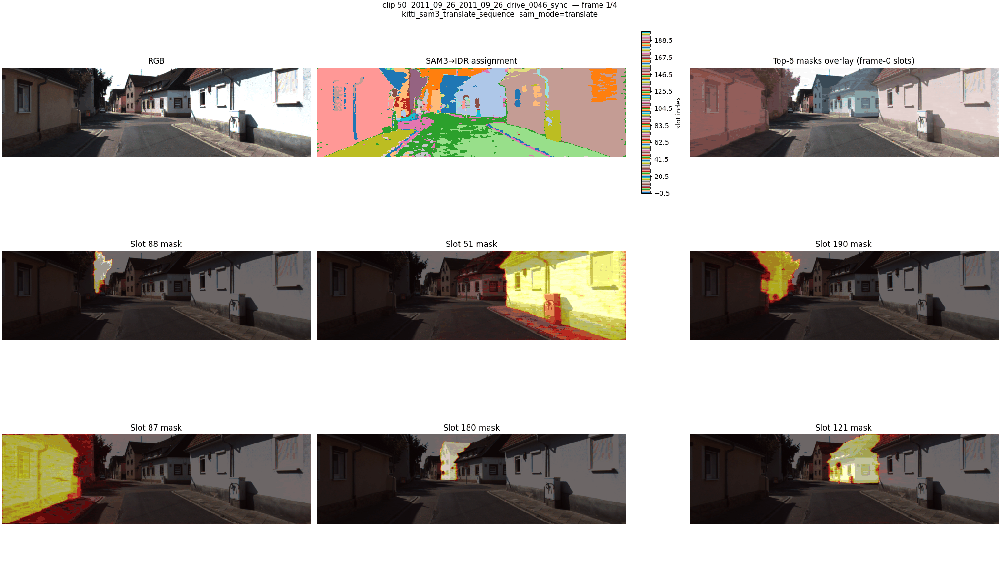 | 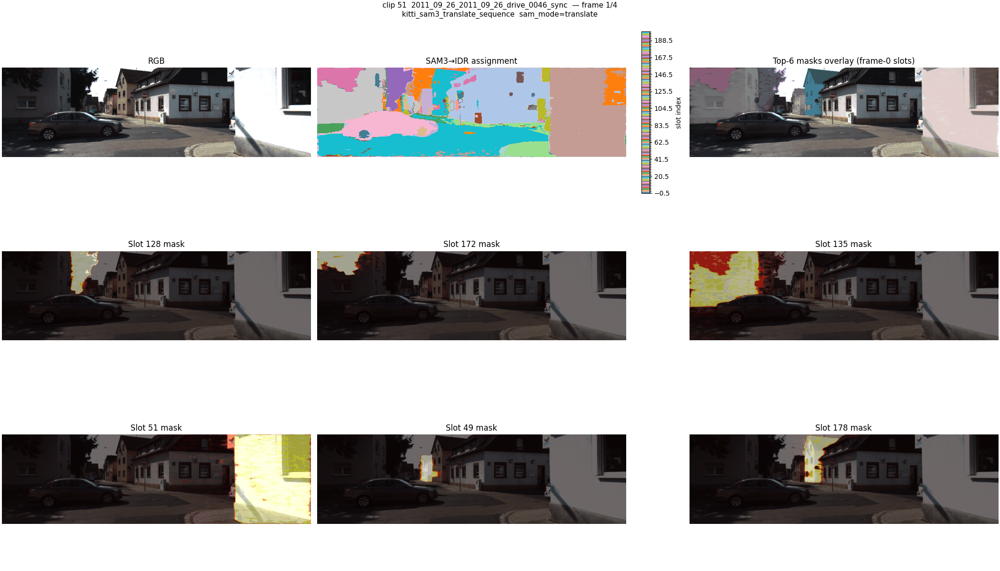 |

**Layout:** `[RGB | SAM3 slot assignment | top-K overlay] / [slot 0 | slot 1 | ...]`

### Video Masklets (`viz_masklets`)

Temporally consistent masklet tracking from `Sam3VideoPixelEncoder`:

| Mode | Clip 050 | Clip 051 |
|------|----------|----------|
| `replace` | 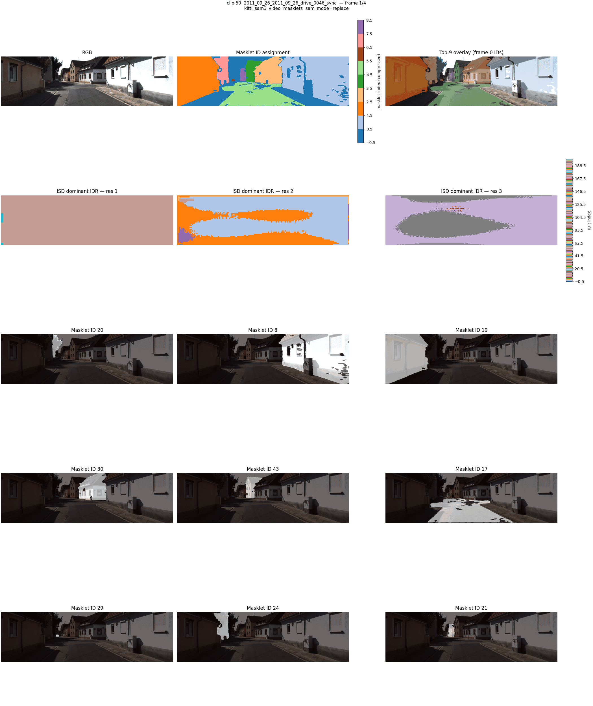 | 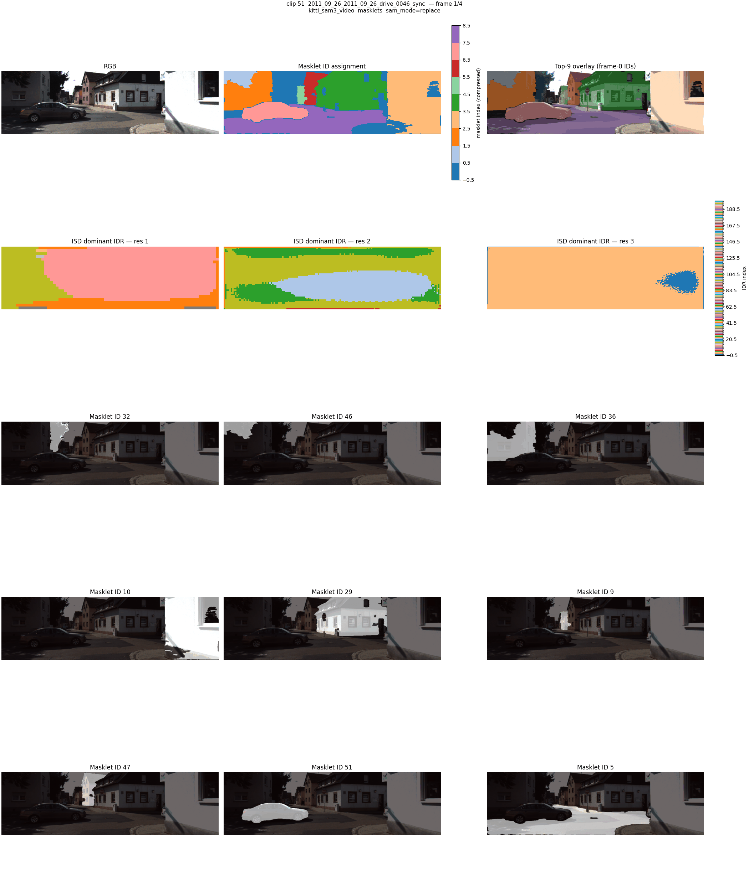 |
| `translate` | 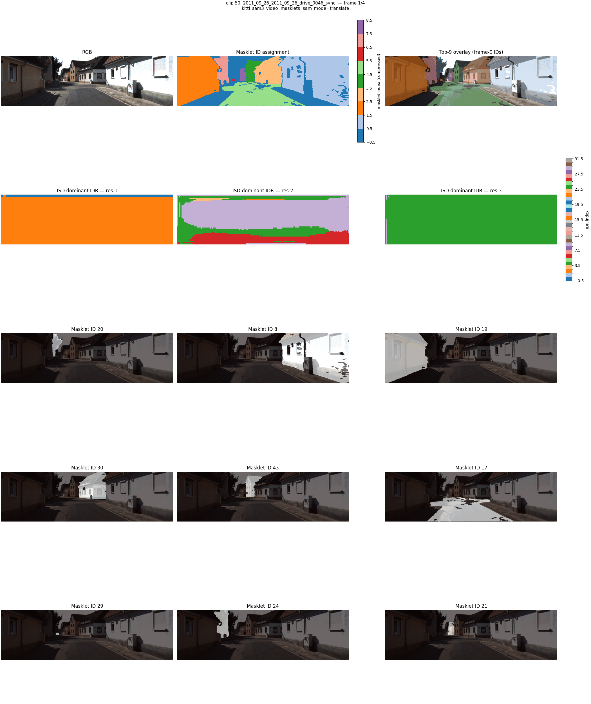 | 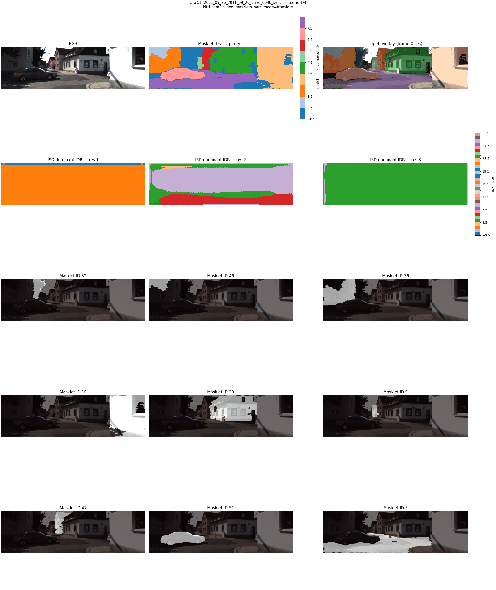 |

**Layout:** `[RGB | Masklet ID assignment | top-K overlay] / [ISD res1 | ISD res2 | ISD res3] / [Masklet 0..N]`

---

## Reproduction

There are three visualization scripts in `scripts/experiments/`. All require a config file, a model checkpoint, and the KITTI base path.

### Cluster paths

```
BASE_PATH   = /work/courses/3dv/team17/idisc
MODEL_R101  = /work/courses/3dv/team17/models/kitti_resnet101.pt
E12_CKPT    = /work/courses/3dv/team17/sam3_checkpoints/E12-online-sam3-translate/best_sam_finetuned.pt
E15_CKPT    = /work/courses/3dv/team17/models/models_tkwiecinski/E15-online-sam3-video-translate/best_sam_finetuned.pt
E20_CKPT    = /work/courses/3dv/team17/models/models_tkwiecinski/E20-sam3-pure-multiclass/best_sam_finetuned.pt
```

### 1. `visualize_sequence.py` — IDR attention over clips

Renders depth prediction, GT depth, and ISD dominant-IDR maps across 3 FPN resolutions. Works with both image and video encoder configs.

```bash
python scripts/experiments/visualize_sequence.py \
  --config-file <config.json> \
  --model-file  <checkpoint.pt> \
  --base-path   $BASE_PATH \
  --output-dir  outputs/runs/viz_seq \
  --sam-mode    <none|replace|translate> \
  --start-clip  50 --num-clips 2 --clip-length 4 --fps 1
```

Use `--soft-assignment` for weighted-average IDR index (continuous colormap) instead of hard argmax, but I didn't really used that.

Example configs:
- Image encoder: `configs/kitti/kitti_sam3_translate.json`, `configs/kitti/kitti_sam3.json`
- Video encoder: `configs/kitti/kitti_sam3_video.json`
- Baseline (no SAM3): `configs/kitti/kitti_r101.json` with `--sam-mode none`

### 2. `visualize_sam3.py` — SAM3 image encoder masks

Shows per-frame SAM3 segmentation slot assignments and top-K mask overlays. Requires a SAM3 image encoder config.

```bash
python scripts/experiments/visualize_sam3.py \
  --config-file configs/kitti/kitti_sam3_translate.json \
  --model-file  <checkpoint.pt> \
  --base-path   $BASE_PATH \
  --output-dir  outputs/runs/viz_sam3 \
  --sam-mode translate \
  --start-clip 50 --num-clips 2 --clip-length 4 --fps 1
```

### 3. `visualize_sam3_masklets.py` — Video encoder masklets

Uses `Sam3VideoPixelEncoder` for temporally consistent object tracking. Requires a video encoder config (`kitti_sam3_video.json`).

```bash
python scripts/experiments/visualize_sam3_masklets.py \
  --config-file configs/kitti/kitti_sam3_video.json \
  --model-file  <checkpoint.pt> \
  --base-path   $BASE_PATH \
  --output-dir  outputs/runs/viz_masklets \
  --sam-mode    <replace|translate> \
  --start-clip  50 --num-clips 2 --clip-length 4 \
  --num-masklets 9 --fps 1
```

### Common flags

| Flag | Default | Description |
|------|---------|-------------|
| `--sam-mode` | `none` | `none` AFP only, `replace` SAM3 linear proj, `translate` Sam3QueryToIDR cross-attention |
| `--soft-assignment` | off | Weighted-average IDR index instead of hard argmax (only `visualize_sequence.py`) (note: I didn't really used that) |
| `--num-masklets` | 6 | Number of top-scoring masklets to display (only `visualize_sam3_masklets.py`) |
| `--clip-length` | from config | Frames per clip |
| `--start-clip` | 0 | Dataset clip index to start from |
| `--num-clips` | 3 | Number of clips to visualize |
| `--format` | `gif` | Output format: `gif` or `mp4` (mp4 needs ffmpeg) |
| `--fps` | 2 | Animation frame rate |

---

## Quick Reproduce

Paste-ready commands that reproduce all GIFs in `gifs/`. Run from the repo root.

```bash
BP=/work/courses/3dv/team17/idisc
E12=/work/courses/3dv/team17/sam3_checkpoints/E12-online-sam3-translate/best_sam_finetuned.pt
E20=/work/courses/3dv/team17/models/models_tkwiecinski/E20-sam3-pure-multiclass/best_sam_finetuned.pt
R101=/work/courses/3dv/team17/models/kitti_resnet101.pt
E21=/work/courses/3dv/team17/sam3-video-fixed/best_sam_finetuned.pt

# --- viz_seq: image encoder IDR maps (baseline / replace / translate) ---
python scripts/experiments/visualize_sequence.py --config-file configs/kitti/kitti_r101.json          --model-file $R101 --base-path $BP --sam-mode none      --output-dir outputs/runs/viz_seq       --start-clip 50 --num-clips 3 --clip-length 4 --fps 1
python scripts/experiments/visualize_sequence.py --config-file configs/kitti/kitti_sam3.json           --model-file $E20  --base-path $BP --sam-mode replace   --output-dir outputs/runs/viz_seq       --start-clip 50 --num-clips 3 --clip-length 4 --fps 1
python scripts/experiments/visualize_sequence.py --config-file configs/kitti/kitti_sam3_translate.json --model-file $E12  --base-path $BP --sam-mode translate --output-dir outputs/runs/viz_seq       --start-clip 50 --num-clips 3 --clip-length 4 --fps 1

# --- viz_seq_video: video encoder IDR maps (replace / translate) ---
python scripts/experiments/visualize_sequence.py --config-file configs/kitti/kitti_sam3_video.json     --model-file $E20  --base-path $BP --sam-mode replace   --output-dir outputs/runs/viz_seq_video --start-clip 50 --num-clips 3 --clip-length 4 --fps 1
python scripts/experiments/visualize_sequence.py --config-file configs/kitti/kitti_sam3_video.json     --model-file $E12  --base-path $BP --sam-mode translate --output-dir outputs/runs/viz_seq_video --start-clip 50 --num-clips 3 --clip-length 4 --fps 1
# E21 run with replace mode - fixed sam3
python scripts/experiments/visualize_sequence.py --config-file configs/kitti/kitti_sam3_video.json     --model-file $E21  --base-path $BP --sam-mode replace --output-dir outputs/runs/viz_seq_video_e21 --start-clip 50 --num-clips 3 --clip-length 4 --fps 1

# --- viz_sam3: image encoder SAM3 masks ---
python scripts/experiments/visualize_sam3.py     --config-file configs/kitti/kitti_sam3_video.json     --model-file $E12  --base-path $BP --sam-mode translate --output-dir outputs/runs/viz_sam3      --start-clip 50 --num-clips 3 --clip-length 4 --fps 1

# --- viz_masklets: video encoder masklet tracking (replace / translate) ---
python scripts/experiments/visualize_sam3_masklets.py --config-file configs/kitti/kitti_sam3_video.json              --model-file $E20 --base-path $BP --sam-mode replace   --output-dir outputs/runs/viz_masklets --start-clip 50 --num-clips 3 --clip-length 4 --fps 1 --num-masklets 9
python scripts/experiments/visualize_sam3_masklets.py --config-file configs/kitti/kitti_sam3_translate_sequence.json  --model-file $E12 --base-path $BP --sam-mode translate --output-dir outputs/runs/viz_masklets --start-clip 50 --num-clips 3 --clip-length 4 --fps 1 --num-masklets 9
```
