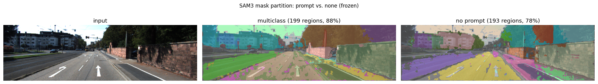
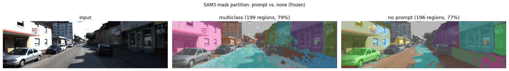
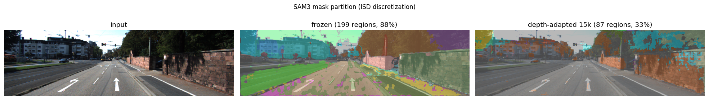
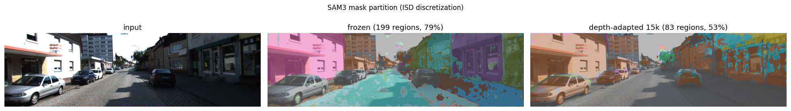
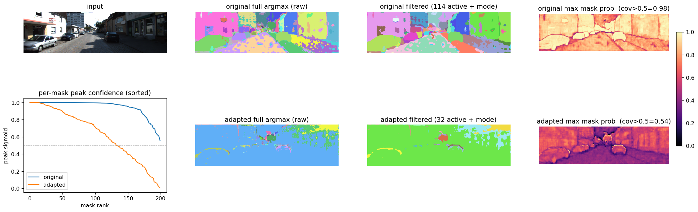
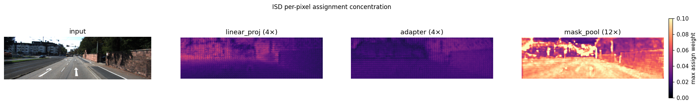
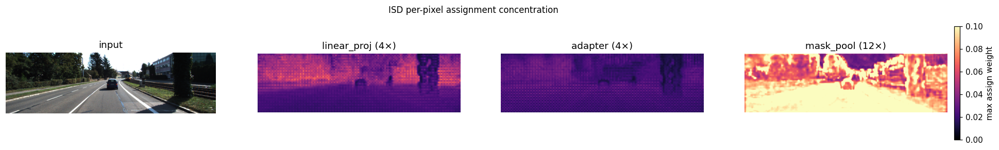

# SAM3+iDisc — Depth Estimation Experiments (KITTI Eigen)

**Task:** monocular depth estimation, KITTI Eigen split, abs_rel ↓.  
**Baseline:** iDisc ResNet-101 repro, abs_rel = 0.060.  
**Setup throughout:** SAM3 ViT-L/14 backbone (~840 M params, frozen unless noted),
letterbox 1008² input, KITTI Eigen crop, OneCycleLR, effective batch 2,
head LR 5e-5 / SAM3 LR 1e-5.

## Key results

| approach | abs_rel ↓ | note |
|----------|-----------|------|
| ResNet-101 baseline | 0.060 | full backbone trained |
| `adp_mem_e2e` (best learned-IDR config) | 0.0686 @5k / **0.0610** @15k | §1 |
| **`mask_pool` e2e (SAM3 masks as discretization)** | 0.0685 @5k / **0.0609** @15k | §3 |

Main finding (§3): replacing iDisc's learned AFP slot-attention with **SAM3's object masks**
— pooled into cluster centers and scattered back as the pixel-to-center assignment — yields
an internal discretization that matches the best learned-IDR configuration at both 5k and 15k,
and reaches the ResNet-101 baseline (0.060) with the ViT trunk frozen. The discretization is
grounded in object masks rather than learned slot-attention, at no accuracy cost. The result
required the segmentation head to adapt under depth loss (frozen masks underperform, §3).

Secondary findings: end-to-end unfreezing of the post-trunk SAM3 stack is the largest matrix
lever (§1); text-fused features outweigh spatial resolution (§1); trunk LoRA gives no gain
(§2).

---

## 1. Paradigm matrix

The question was which axes move the depth metric when using SAM3 as the pixel encoder.
Three axes were swept:

- **pixel source** — which feature pyramid feeds ISD
- **trainable SAM3 modules** — frozen vs. e2e post-trunk stack
- **IDR source** — how instance-level depth representations are formed

### Architecture: data flow

```
image (1008²)
  └─ SAM3 ViT-L trunk  [frozen throughout]
       └─ neck (4 conv layers, 256-ch)
            ├─ backbone_fpn  →  [288², 144², 72²] × 256-ch
            └─ SAM3 encoder (MSDeformAttn, 6 levels)
                 └─ SAM3 decoder (100 query slots)
                      └─ 200 object queries  (K×256)
                      └─ memory (72²×256, text-fused)

pixel_source selects the pyramid:
  msda        →  backbone_fpn → MSDeformAttn pixel decoder (6-layer FPN) → [72²,144²,288²]×256
  sam3_memory →  memory (72²) → MemoryFPN (learned, 3-level) → [36²,72²,144²]×256
  backbone_fpn → backbone_fpn (neck pyramid, no decoder)      → [72²,144²,288²]×256

IDR source (sam_mode):
  linear_proj  →  sam3_proj: nn.Linear(256→256) × 3 levels applied to K queries → (1,K,256)×3
  adapter      →  ContextAdapter: depth-2 self-attn + full-map cross-attn per level → (1,K,256)×3

ISD: per-level ISDHead cross-attends pixel features (B,h×w,256) to IDRs (B,K,256) → depth logits
```

### Configs

| # | pixel_source | SAM3 trainable | sam_mode | pyramid finest | IDR params |
|---|-------------|----------------|----------|---------------|------------|
| 1 `lp_msda_frozen` | msda | — | linear_proj | 288² (post-MSDA) | 3 × Linear(256,256) |
| 2 `lp_msda_e2e` | msda | neck, encoder, decoder | linear_proj | 288² | 3 × Linear(256,256) |
| 3 `lp_mem_e2e` | sam3_memory | neck, encoder, decoder | linear_proj | 144² | 3 × Linear(256,256) |
| 4 `adp_mem_e2e` | sam3_memory | neck, encoder, decoder | adapter | 144² | ContextAdapter ~3 M |
| 5 `adp_bbfpn_e2e` | backbone_fpn | neck, encoder, decoder | adapter | 288² | ContextAdapter ~3 M |

Each step changes exactly one variable: 1→2 freeze/e2e, 2→3 pixel source, 3→4 IDR thickness, 4→5 pixel source resolution.

### Results

| Config | abs_rel ↓ | d1 ↑ | d2 ↑ | rmse ↓ | rmse_log ↓ |
|--------|-----------|------|------|--------|-----------|
| 1 `lp_msda_frozen` | 0.0782 | 0.937 | 0.993 | 2.646 | 0.110 |
| 2 `lp_msda_e2e` | 0.0734 | 0.949 | 0.995 | 2.463 | 0.103 |
| 3 `lp_mem_e2e` | 0.0691 | 0.955 | 0.994 | 2.470 | 0.099 |
| 4 `adp_mem_e2e` | **0.0686** | 0.955 | 0.994 | 2.459 | 0.099 |
| 4·15k `adp_mem_e2e` | **0.0610** | 0.966 | 0.996 | 2.302 | 0.089 |
| 5 `adp_bbfpn_e2e` | 0.0821 | 0.936 | 0.993 | 2.675 | 0.114 |

### Per-config data flow (code-grounded)

Traced through `sam3_encoder.py` (`_run_once` → `_grad_grounding` picks `_run_once_grad`
if any of `sam3_trainable`/`lora`/`mask_pool` else `_run_once_frozen`), `idisc.py:forward`
(pixel_decoder presence + `sam_mode` dispatch), and `id_module.py` (ISDHead/AFP/ContextAdapter).
ViT-L trunk + text encoder are frozen in every row. Resolutions at letterbox 1008²/patch 14 → 72².

| config | encoder path | pixel branch → ISD pyramid | discretization (IDR) source | trainable (besides iDisc head) |
|--------|-------------|----------------------------|-----------------------------|-------------------------------|
| 1 `lp_msda_frozen` | `_run_once_frozen` | `backbone_fpn` (neck.convs) → `MSDeformAttnPixelDecoder` → [288,144,72] | `sam3_proj[i](queries)` Linear(256→256) → ISDHead `cross_attn(feat, idr)` | — (SAM3 fully frozen) |
| 2 `lp_msda_e2e` | `_run_once_grad` | same as 1 (MSDA decoder) | same as 1 | neck, encoder, decoder |
| 3 `lp_mem_e2e` | `_run_once_grad` | `_memory_map(encoder_hidden_states)` 72² → `MemoryFPN(top_scale=2)` → [144,72,36]; `pixel_decoder=None` | same as 1 | neck, encoder, decoder |
| 4 `adp_mem_e2e` | `_run_once_grad` | same as 3 | `ContextAdapter(queries, decoder_outputs)` self+cross-attn ×2 → ISDHead `cross_attn` | neck, encoder, decoder |
| 5 `adp_bbfpn_e2e` | `_run_once_grad` | `backbone_fpn` direct (no MemoryFPN, no MSDA) → [288,144,72] | same as 4 | neck, encoder, decoder |

`queries = out["queries"]` (K×256 decoder slots); ISDHead with `idrs` runs `depth×[cross_attn + mlp]`.
`msda` is the only branch that keeps iDisc's `MSDeformAttnPixelDecoder`; `sam3_memory`/`backbone_fpn`
set `pixel_decoder=None` and feed ISD directly (`fpn_outputs = decoder_outputs = encoder_outputs`).

### Deltas

| edge | one var changed | Δ abs_rel | mechanism (no interpretation) |
|------|-----------------|-----------|-------------------------------|
| 1→2 | frozen → e2e (neck+enc+dec @1e-5) | −0.005 | post-trunk SAM3 stack receives depth grad |
| 2→3 | msda → sam3_memory | −0.004 | drops MSDA decoder (~15 M) for text-fused memory + MemoryFPN (~0.5 M); 288²→144² |
| 3→4 | linear_proj → adapter | −0.001 | thin Linear IDR → ContextAdapter (~3 M) |
| 4→5 | sam3_memory → backbone_fpn | +0.013 | text-fused 144² → raw neck 288²; no text fusion |

**Resolution control** (isolates 4→5 to semantics, not resolution): config 4 with `memory_fpn_scale=4`
gives sam3_memory the same [288,144,72] pyramid as backbone_fpn → **adp_mem@288 = 0.0687** (d1=0.954,
rmse=2.461), within noise of adp_mem@144 (0.0686), still ≫ backbone_fpn@288 (0.0821). Fits 16 GB.

### Code changes

**`pixel_source` routing (`idisc/models/idisc.py`, `idisc/models/sam3_encoder.py`):**
`pixel_source ∈ {msda, sam3_memory, backbone_fpn}` is read in `IDisc.build`. For
`sam3_memory` and `backbone_fpn`, `pixel_decoder = None`; the encoder features feed ISD
directly. For `msda`, `MSDeformAttnPixelDecoder` is built as before.

**`MemoryFPN` (`idisc/models/id_module.py`):** converts the single 72²×256 memory tensor
to a 3-level pyramid [144²,72²,36²]×256 using ConvTranspose2d (stride 2, upsample),
Conv2d (stride 1, same), and Conv2d (stride 2, downsample) with GroupNorm and GELU.

**`sam3_trainable` (`idisc/models/sam3_encoder.py:_sam3_submodule`):**
```
neck    → sam_model.backbone.vision_backbone.convs   (4 × Conv2d, 256-ch)
encoder → sam_model.transformer.encoder              (6-level MSDeformAttn)
decoder → sam_model.transformer.decoder              (100 query slots)
head    → sam_model.segmentation_head                (maskformer, produces pred_masks)
```
Trunk (`vision_backbone.trunk`, ViT-L, ~307 M) and text encoder always frozen.

**`sam_mode` dispatch (`idisc/models/idisc.py:forward`):**
```python
if sam_mode == "adapter":   idrs = context_adapter(queries, decoder_outputs)   # (B,K,256)×3
elif sam_mode == "linear_proj": idrs = tuple(proj(queries) for proj in sam3_proj)
elif sam_mode == "mask_pool":   outs = isd(fpn_outputs, masks=encoder_masks)   # see §3
else:                           idrs = afp(decoder_outputs)                    # baseline
```

**`config_bridge._validate`:** single validation gate for all legal combinations of
`sam_mode × pixel_source × encoder × prompt_mode` — violated combinations raise at startup.

---

## 2. Trunk LoRA

**Motivation:** the matrix showed the post-trunk stack (neck/encoder/decoder) accounts for
most of the gain. The ViT-L trunk (~307 M params) remains frozen. Low-rank adaptation (LoRA)
on the trunk attention layers is a parameter-efficient way to test whether the trunk itself
is a remaining bottleneck.

**Implementation (`idisc/models/lora.py`, `idisc/models/sam3_encoder.py`):**
`LoRALinear` wraps a frozen `nn.Linear` with a trainable low-rank path:
`y = W₀x + (α/r) B(Ax)`, where A ∈ ℝ^{r×d_in}, B ∈ ℝ^{d_out×r}, B zero-initialised
(no change at step 0). Applied to `qkv` (d_in=1024, d_out=3072) and `proj` (d_in=1024,
d_out=1024) in all 32 ViT-L attention blocks → 64 wrapped layers, ~2 M trainable params.

SAM3's MLP uses a fused `addmm_act` kernel that asserts grad is disabled (inference
fast-path). A module-level monkeypatch replaces it with the standard `act(linear(x))` path
when `torch.is_grad_enabled()`, leaving the frozen path unaffected. ViT-L's per-block
activation checkpointing (gated on `self.training` in `vitdet.py`) is re-enabled by putting
the trunk in train mode during the forward pass.

**Results (5k)**

| Config | abs_rel ↓ |
|--------|-----------|
| `lp_mem_e2e` (frozen trunk) | 0.0691 |
| `lp_mem_e2e` + trunk LoRA | 0.0688 |
| `adp_mem_e2e` (frozen trunk) | 0.0686 |
| `adp_mem_e2e` + trunk LoRA | 0.0696 |

The differences are within run-to-run noise. The trunk is not the bottleneck at 5k; the
post-trunk stack's adaptation already extracts the available signal from the frozen features.

---

## 3. mask_pool — SAM3 masks as the ISD discretization

**Motivation:** varying the IDR centers (linear_proj, adapter, LoRA) produced marginal
changes, suggesting the learned soft-clustering bottleneck (AFP → ISD assignment) is the
weak component, not the center content. SAM3's segmentation head produces per-object mask
logits `pred_masks ∈ ℝ^{B×K×H_m×W_m}` from the decoder queries; these encode a spatial
soft-clustering of the image that is currently unused. The idea is to replace AFP's
learned slot-attention with SAM3's masks — using them for both center pooling and pixel
assignment within ISD.

**Why pool+scatter instead of pool→project:**
If the pooled centers are passed through `sam3_proj` (a learned Linear), SGD can learn any
linear transform of the center, which washes out the constraint that centers lie in the same
feature space as the pixels they represent. The matrix showed this path (linear_proj) is
the weak lever. The pooling only carries structural meaning if the same masks also determine
which pixels receive which center (closed loop): pool to get centers, scatter back by masks.

**Design (`idisc/models/id_module.py: ISD.forward`, `ISDHead.forward`):**

Per ISD level `i` with pixel features `xs[i] ∈ ℝ^{B×256×h_i×w_i}`, K=200 mask slots:

```
pred_masks: (B, K, H_m, W_m)  ← SAM3 maskformer output at ~250²
m_i       = sigmoid(bilinear_resize(pred_masks, (h_i, w_i)))   # (B, K, h_i, w_i)
              resize logits before sigmoid — avoids halos from interpolating saturated probs

mf        = m_i.flatten(2)                       # (B, K, h_i·w_i)
xf        = xs[i].flatten(2).transpose(1,2)      # (B, h_i·w_i, 256)

centers_i = mf @ xf / (mf.sum(-1,keepdim=True) + ε)           # (B, K, 256)  masked-avg pool
assign_i  = (mf / (mf.sum(1,keepdim=True) + ε)).transpose(1,2) # (B, h_i·w_i, K)

upd       = assign_i @ value_proj_i(centers_i)   # (B, h_i·w_i, 256)
x         = x + upd
x         = x + mlp_i(x)                         # per-pixel MLP for within-object depth
out_i     = proj_output(x)                        # (B, 1, h_i, w_i)
```

`value_proj_i: Linear(256, 256)` is the only new learned parameter per ISD level (3 total,
~0.2 M params). Background pixels (not covered by any mask) have `assign≈0`, so their
update is near-zero and depth falls back to the per-pixel MLP path. The existing cross-attention
and AFP modules are bypassed entirely in this path.

**Resize direction:** mask logits (~250²) are downsampled to the feature grid (h_i, w_i)
rather than upsampling the features. Since pooling collapses spatial extent to a single
vector per object, fine boundary detail in the mask does not improve the center estimate.
Downsampling is 12–50× cheaper than upsampling 256-channel features to ~250².

**Detach rule:** `m_i.detach()` is applied when `pred_masks.requires_grad is False`
(frozen SAM3 path). When `head` is added to `sam3_trainable`, the segmentation head is
unfrozen and depth loss flows through the mask logits, allowing the discretization to
adapt toward depth-relevant objects.

**Prompt ablation:** multiclass (`[vehicle, tree, road, building]`) vs. empty prompt `""`
(visual-only, no text conditioning):

| Config | abs_rel ↓ |
|--------|-----------|
| frozen SAM3, multiclass, 5k | 0.0893 |
| frozen SAM3, visual-only, 5k | 0.0885 |

Mask partition under each prompt (`visualize_prompt_compare.py`, same frozen head, text only):




**Full results**

| Config | abs_rel ↓ | d1 ↑ | rmse ↓ |
|--------|-----------|------|--------|
| `mask_pool` frozen, multiclass, 5k | 0.0893 | 0.912 | 2.994 |
| `mask_pool` frozen, visual-only, 5k | 0.0885 | 0.913 | 3.003 |
| `mask_pool` frozen, multiclass, 15k | 0.0788 | 0.933 | 2.770 |
| `mask_pool` e2e (neck+enc+dec+head), 5k | 0.0685 | 0.956 | 2.462 |
| `mask_pool` e2e (neck+enc+dec+head), 15k | **0.0609** | 0.965 | 2.316 |
| `mask_pool` + backbone_fpn e2e, 5k | 0.0756 | 0.944 | 2.573 |

### Data flow (code-grounded, `ISD.forward(masks=…)`)

`mask_pool=True` forces `_run_once_grad`; the trailing instance is `out["pred_masks"]`
(K×~250²) not `out["queries"]`. Per ISD level i (`id_module.py:126-137`):
`m = sigmoid(resize(pred_masks → xs[i].shape))`; `centers = (mf @ xf) / Σ_hw` (masked-avg pool of
the pixel features); `assign = mf / Σ_K` (column-normalised over slots); ISDHead then runs
`feat += assign @ value_proj(centers)` followed by `depth × mlp` — **the cross-attn / AFP /
ContextAdapter path is bypassed entirely** (`ISDHead.forward`, `assign is not None` branch).
Detach gate: `if not masks.requires_grad: m = m.detach()`.

| config | masks.requires_grad | pixel branch → ISD pyramid | trainable (besides `value_proj`) |
|--------|---------------------|----------------------------|----------------------------------|
| frozen (`sam3_trainable=[]`) | False → detached | sam3_memory → [144,72,36] | — (only `value_proj`, 3×Linear 256→256) |
| e2e `[neck,enc,dec,head]` | True (head unfrozen) | sam3_memory → [144,72,36] | neck, encoder, decoder, seg head |
| + backbone_fpn | True | backbone_fpn → [288,144,72] | same; centers pooled from 288² pixels |

**Deltas** (numbers only): frozen 5k 0.0893 → 15k 0.0788 (≈ `lp_msda_frozen` 0.0782); e2e 5k
0.0685 (= matrix winners 0.0686/0.0691); e2e 15k 0.0609 (= `adp_mem_e2e` 0.0610; d1 0.965 / rmse
2.316 vs 0.966 / 2.302); + backbone_fpn 5k 0.0756 (vs sam3_memory mask_pool 0.0685; vs adp_bbfpn
0.0821). Detach control (masks detached under the e2e trainable set) not yet run.

**Mask visualisation** (`visualize_mask_pool.py`): per-pixel dominant-mask partition, frozen vs.
depth-adapted (e2e 15k) head.




Across the 6 sampled images the active-mask count drops from **~198 (frozen)** to **~96–137
(adapted)**: about half the masks fall below threshold, the road merges into ground-plane segments,
sky/far field drop to background. The masks adapt under depth loss (the gain is not purely feature
adaptation); the detach control would quantify how much.

Per-image diagnostic (`diagnose_mask_image.py`): sorted per-mask peak confidence, raw vs. filtered
argmax, per-pixel max mask-prob. Raw-argmax speckle is the silent-mask artefact (sub-threshold
masks still win an argmax).



**Assignment concentration** (`visualize_assignment_compare.py`, 5k): per-pixel max assignment
weight over K=200 slots (uniform = 0.005). For linear_proj/adapter this is ISD's learned
cross-attention over the SAM3-query IDRs; for mask_pool, the mask-derived weights.

| config (5k) | mean max-assignment weight | ×uniform |
|-------------|---------------------------|----------|
| linear_proj | 0.021 | 4× |
| adapter | 0.022 | 4× |
| mask_pool | **0.060** | **12×** |




linear_proj and adapter stay near-uniform — the discretization is bypassed; depth comes from the
FPN features. mask_pool is ~3× more concentrated and structured along scene content, but at 0.060
still far from one-hot (soft assignment). Both reach ~0.069 at 5k: in the query path the accuracy
comes from the features, not the discretization.

---

## 4. Summary

| Experiment | Δ abs_rel | Note |
|-----------|-----------|------|
| e2e unfreeze (neck+enc+dec) | −0.005 | largest single lever |
| sam3_memory vs. msda | −0.004 | text-fused feature vs. learned decoder |
| adapter vs. linear_proj | −0.001 | marginal at e2e |
| backbone_fpn vs. sam3_memory | +0.013 | worse; text fusion outweighs resolution |
| trunk LoRA r=8 (qkv+proj) | ~0 | trunk is not the bottleneck |
| mask_pool frozen 5k vs. lp_msda_frozen | +0.011 | worse; static mask is suboptimal for depth |
| mask_pool frozen 15k | 0.0788 | matches lp_msda_frozen — frozen 5k was schedule-limited |
| mask_pool e2e 5k | 0.0685 | matches e2e winners at 5k |
| **mask_pool e2e 15k** | **0.0609** | matches `adp_mem_e2e` 15k (0.0610) and ResNet baseline (0.060) |
| mask_pool + backbone_fpn e2e 5k | 0.0756 | vs mask_pool+memory 0.0685; > adp_bbfpn 0.0821 |

**Open:** Detach control (e2e set, masks detached) — isolate depth-loss mask shaping from plain
feature adaptation; not yet run. Resolution is resolved (`adp_mem@288` = 0.0687 ≈ 0.0686, and
mask_pool+backbone_fpn 288² = 0.0756 > mask_pool+memory 144² 0.0685): higher pixel resolution does
not help; the sam3_memory advantage is semantic (text fusion), not spatial.
